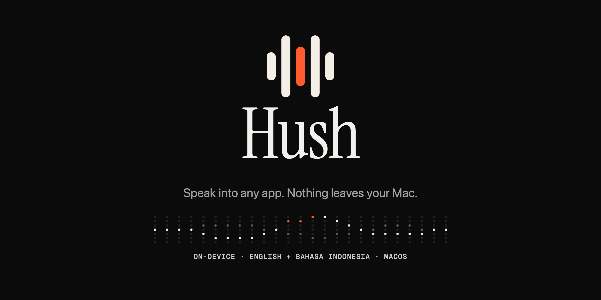
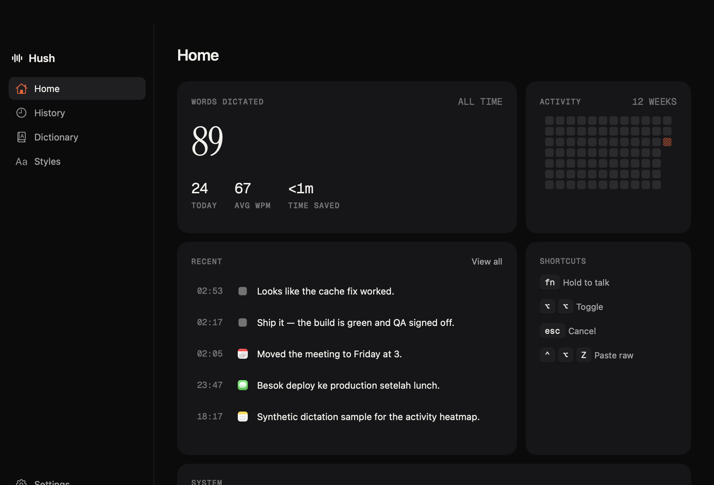
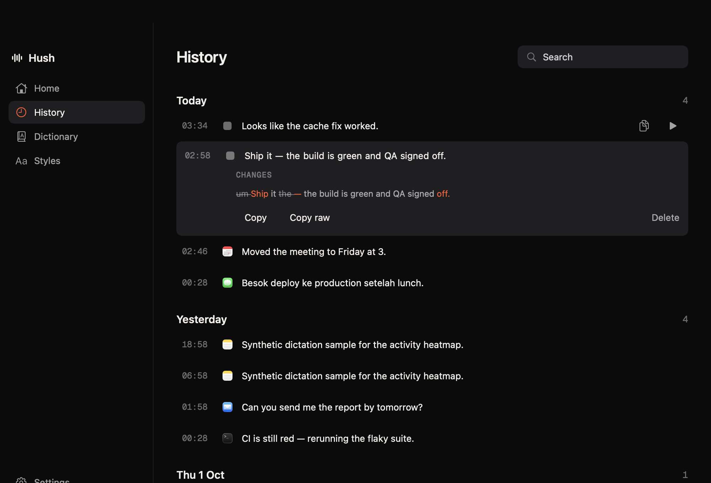
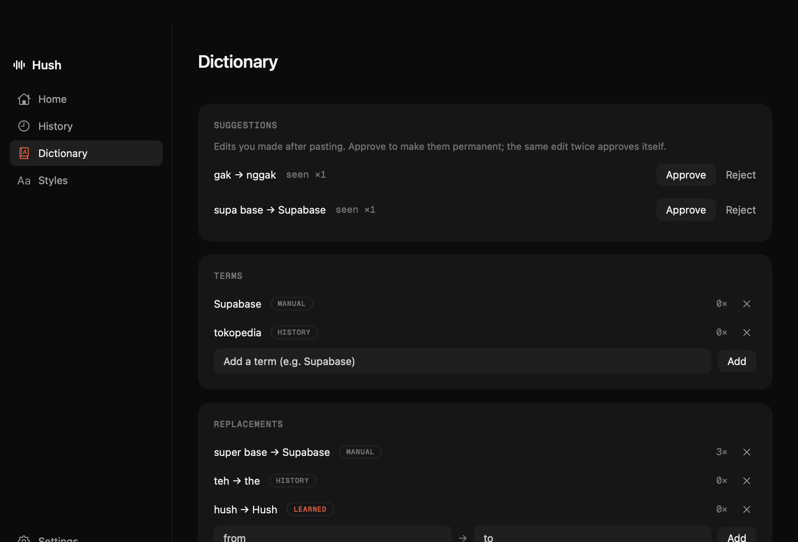
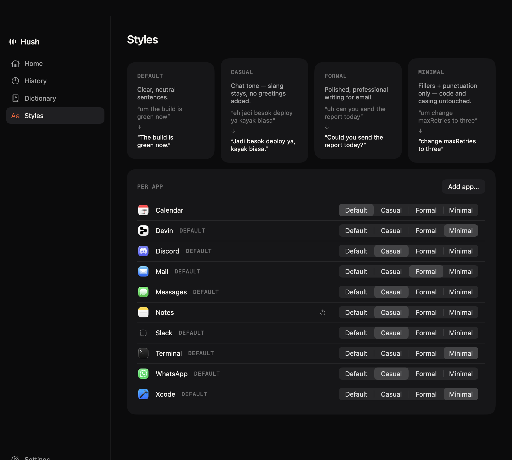
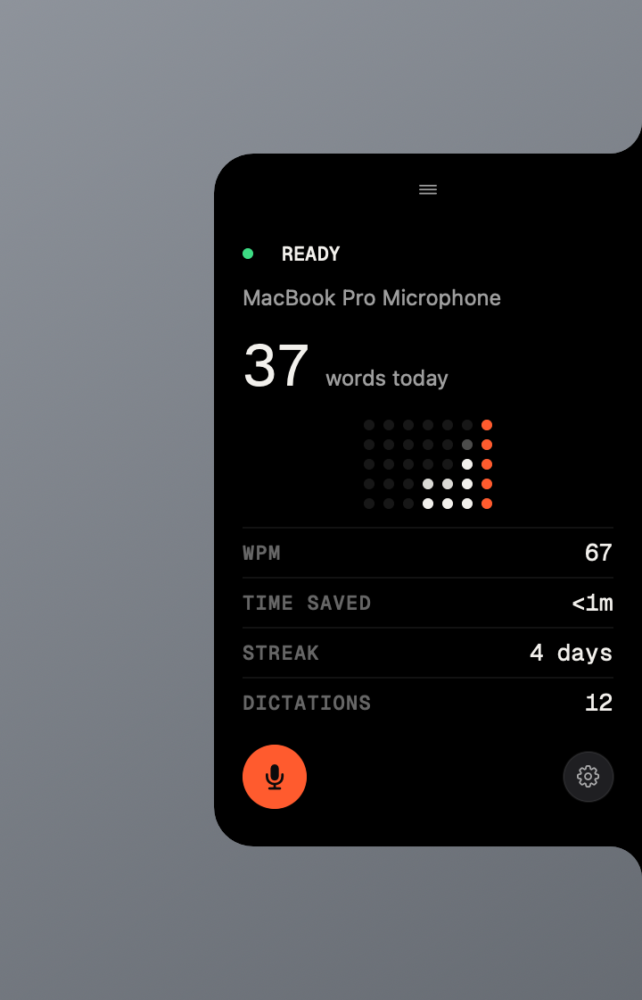

<div align="center">
  
  <p>Local voice dictation for macOS. Hold a key, talk, get cleaned-up text where you're typing.</p>
  <p>
    
    
    
    <a href="LICENSE"></a>
    <a href="https://github.com/mzakyali/hush/actions/workflows/ci.yml"></a>
  </p>
</div>

Hush is an offline-first dictation app: hold **fn**, speak, and cleaned-up
text is inserted into whatever app was focused when you stopped. Recording,
transcription, and cleanup all run on-device — no audio or text ever leaves
your Mac.

It's an early personal project: built for one machine, shared in case it's
useful to others.

## Why Hush

- **Fully local.** Whisper on Core ML for speech recognition, a small local
  LLM (MLX) for cleanup. The only network traffic ever is downloading the
  models on first use; after that everything works with Wi-Fi off.
- **Bilingual by design.** English and Bahasa Indonesia — including
  code-switching *inside one sentence*. Apple's built-ins can't do this:
  `DictationTranscriber` accepts one locale per session, and
  `SFSpeechRecognizer` doesn't run Indonesian on-device (see
  [the spec](docs/specs/hush-v1.md) §2 for the probe results).
- **Cleanup that never drops your words.** The LLM removes fillers and
  fixes punctuation, but a guard validates its output and falls back to the
  raw transcript rather than lose content.
- **Learns from your edits.** Fix a transcription after pasting — say,
  "super base" → "Supabase" — and after seeing it twice Hush learns the
  replacement and applies it to future dictations.

## Screenshots

<table>
  <tr>
    <td></td>
    <td></td>
  </tr>
  <tr>
    <td align="center">Home — stats, a 12-week activity heatmap, and model/permission status.</td>
    <td align="center">History — every dictation with audio playback and a word-level diff of the cleanup.</td>
  </tr>
  <tr>
    <td></td>
    <td></td>
  </tr>
  <tr>
    <td align="center">Dictionary — terms bias the recognizer, replacements are deterministic, suggestions come from your edits.</td>
    <td align="center">Styles — casual for chat, formal for mail, minimal for editors and terminals.</td>
  </tr>
</table>

<table>
  <tr>
    <td width="55%"></td>
    <td></td>
  </tr>
  <tr>
    <td align="center">The side panel docks to a screen edge and expands on hover.</td>
    <td align="center">While recording, a pill floats at the bottom of the screen — the dot-matrix wave is your voice.</td>
  </tr>
</table>

## Features

**Dictation**
- Hold-to-talk (fn) and toggle (double-tap ⌥) global hotkeys; Esc cancels — nothing inserted, nothing saved.
- Records 16 kHz mono from your chosen input; a per-device priority list survives reconnects, and a failed device falls back automatically.
- Inserts into the app focused when recording stops; falls back to the clipboard with a notification when no text field is focused. Your previous clipboard contents are restored after paste.
- ⌃⌥Z re-pastes the raw, uncleaned transcript while the target field still contains the inserted text.

**Cleanup & styles**
- Local LLM removes fillers, fixes punctuation and capitalization, formats lists — never translates; the language mix you spoke is the language mix you get.
- Per-app style profiles: casual (Slack, WhatsApp, Discord, Messages, Telegram), formal (Mail, Outlook), minimal (Xcode, VS Code, terminals — punctuation only, identifiers untouched), default for everything else. Editable.
- A fast path skips the LLM entirely when the transcript is already clean.
- Mid-sentence continuations get lowercased joins and a leading space, read from the text around your caret.

**Dictionary & learning**
- Terms bias the recognizer and tell the cleanup model to spell them exactly.
- Replacements (`super base` → `Supabase`, `gw` → `gue`) are whole-word, case-insensitive, and applied before *and* after cleanup.
- Post-paste edits are watched (Accessibility API, 60 s window) and become suggestions — approve once, or let the same edit approve itself the second time.

**History & stats**
- Searchable history with audio playback and a word-level diff of what cleanup changed.
- Words dictated, WPM, time saved, streaks — kept as daily aggregates that survive retention.

**Surfaces**
- Side panel: a slim rail docked to the screen edge (status ring + record button), expanding on hover to stats and controls. Draggable; always snaps to an edge.
- Recording pill: a non-activating capsule with a live dot-matrix waveform. Never steals focus.
- Menu bar extra and Touch Bar controls (on Touch Bar Macs).

## How it works

```
hotkey down/toggle → record 16 kHz mono ────────────────→ overlay pill (live wave)
                                       └→ on stop:
   Whisper ASR (decoded twice — forced EN and forced ID, higher-confidence wins)
   → dictionary replacements
   → cleanup LLM (style profile + dictionary terms)   [skipped when already clean]
   → dictionary replacements again (guarantees)
   → insert into app focused at stop (clipboard fallback)
   → history + stats → edit watcher (learns from your fixes)
```

| Model | Role | Size on disk | Licence / terms |
|---|---|---|---|
| Whisper large-v3-turbo (Core ML, `argmaxinc/whisperkit-coreml`) | Speech recognition | ~620 MB | MIT |
| Qwen3-4B-Instruct-2507-4bit (`mlx-community`, MLX) | Cleanup | ~2.1 GB | Apache-2.0 |
| Gemma 3 4B it 4bit (`mlx-community`) | Cleanup fallback | downloaded only if Qwen fails | Gemma Terms of Use |

Models download on first use from Hugging Face and live in
`~/Library/Application Support/Hush/models/`. They're loaded lazily and
unloaded after 10 min idle. You are responsible for complying with each
model's licence — see [THIRD_PARTY_NOTICES.md](THIRD_PARTY_NOTICES.md).

## Shortcuts

| Key | Action |
|---|---|
| `fn` (hold) | Hold to talk; release to transcribe and insert |
| `⌥` `⌥` (double-tap) | Toggle recording on/off |
| `esc` | Cancel — nothing is inserted or saved |
| `⌃` `⌥` `Z` | Re-paste the raw transcript over the last insertion |

## Privacy

- **No network access except model download.** When the model files already
  exist on disk, launch and dictation make zero network requests.
- **Never reads secure fields.** `AXSecureTextField` and Secure Event Input
  contexts are never read or watched.
- **No transcript text in logs.** Diagnostic logs carry timings and state,
  never what you said.
- **Everything stays in the data dir.** `~/Library/Application Support/Hush/`
  holds `hush.sqlite`, `audio/*.m4a`, and `models/`.
- **Retention.** Dictations and their audio are deleted after the retention
  window (currently a fixed 30 days); dictionary entries, suggestions, and
  stats aggregates are never auto-deleted.

## Requirements

- Apple Silicon Mac (arm64 only)
- macOS 26 (Tahoe) or later
- 16 GB RAM recommended
- ~3 GB disk for models
- Xcode 27 (tested; Swift 6.4) — needs the Metal toolchain component once:
  `xcodebuild -downloadComponent MetalToolchain`
- [XcodeGen](https://github.com/yonaskolb/XcodeGen): `brew install xcodegen`

## Build & install

There are no prebuilt binaries yet — build from source:

```bash
git clone https://github.com/mzakyali/hush.git
cd hush
scripts/install.sh        # xcodegen → Release build → installs /Applications/Hush.app → launches
```

Or build manually:

```bash
xcodegen generate
xcodebuild -project Hush.xcodeproj -scheme Hush -configuration Debug \
  -destination 'platform=macOS' \
  -skipPackagePluginValidation -skipMacroValidation \
  build
```

**First run:**
1. Grant **Microphone**, **Accessibility**, and **Input Monitoring** when
   prompted (the app needs them to record, read the insertion context, and
   capture the global hotkey).
2. The first model load can take a while — models download (~2.7 GB) and
   the ASR model goes through a one-time Core ML compile (10+ min; watch
   `ANECompilerService`). The compiled result is cached, so later loads
   take ~4 s.
3. Hush is signed **ad-hoc**, so macOS treats every rebuild as a new app:
   the permission grants must be re-approved after each install. If you
   have a stable signing identity, set `CODE_SIGN_IDENTITY` in
   `project.yml` and grants survive rebuilds.

## Project layout

```
App/                    SwiftUI + AppKit app target (windows are NSPanels, not SwiftUI windows)
Packages/HushKit/       all logic — one library target per module
docs/specs/hush-v1.md   product spec
docs/brand/             brand assets + guidelines
scripts/                install.sh, render-icon.swift, render-brand.swift
spike/ui-snapshots/     rendered UI states (visual regression references)
```

| Module | Responsibility |
|---|---|
| `HushCore` | Shared types, pipeline, word diff, style resolver |
| `HotkeyService` | Global hold/toggle/Esc/undo hotkeys (CGEventTap) |
| `AudioCapture` | AVAudioEngine, device selection & priority, level meter, m4a |
| `Transcription` | WhisperKit transcriber, forced EN/ID decode + confidence pick |
| `Cleanup` | MLX LLM cleanup, output guard, clean-text fast path |
| `Dictionary` | Terms, replacements, suggestions |
| `Insertion` | Target detection, paste, clipboard restore, paste-raw |
| `EditWatcher` | Observes the pasted element, diffs edits → suggestions |
| `Store` | GRDB/SQLite persistence, retention, stats |
| `Media` | Placeholder (auto-pause not implemented yet) |

Engines sit behind protocols (`Transcriber`, `Cleaner`, …) so they're
swappable and testable. Swift 6 strict concurrency throughout.

## Development

```bash
swift test --package-path Packages/HushKit     # all logic tests (fakes, no model downloads)

# Re-render UI snapshots — Debug-only flag on the built app:
BUILD_DIR=$(xcodebuild -project Hush.xcodeproj -scheme Hush -configuration Debug \
  -destination 'platform=macOS' -showBuildSettings \
  | awk '/CONFIGURATION_BUILD_DIR =/{print $3; exit}')
"$BUILD_DIR/Hush.app/Contents/MacOS/Hush" --render-snapshots <dir>
```

Integration tests that need real models are opt-in:
`HUSH_INTEGRATION=1 swift test --package-path Packages/HushKit --filter …`

UI changes should follow `DESIGN.md` and re-render `spike/ui-snapshots/`.

## Roadmap / not yet implemented

- Media auto-pause during recording (module is a placeholder).
- Onboarding flow (first-run hotkey instructions, model-download progress).
- Settings: retention-days picker, typing-WPM setting, hotkey rebinding.
- From the v2 list in the spec: command mode, snippets, more languages.

## Known limitations

- **Ad-hoc signing** means macOS permissions must be re-granted after every
  rebuild (see Build & install).
- **ASR latency** is roughly 1.5–2.5 s after you stop: the audio is decoded
  twice (English and Indonesian) and the better decode wins.
- **Touch Bar** support uses private DFR APIs — everything is
  runtime-resolved and guarded, and degrades silently on machines without a
  Touch Bar.
- Language support is focused on English + Indonesian; other languages
  aren't a goal for v1.

## Contributing

See [CONTRIBUTING.md](CONTRIBUTING.md). Bug reports and feature requests
are welcome — this is a personal project, so responses may be slow and
scope is deliberately narrow.

## License

[MIT](LICENSE) — Copyright (c) 2026 Muhammad Zaky.

Third-party libraries, fonts, and models are covered by their own licences;
see [THIRD_PARTY_NOTICES.md](THIRD_PARTY_NOTICES.md).

## Acknowledgements

[WhisperKit](https://github.com/argmaxinc/WhisperKit) /
[argmax-oss-swift](https://github.com/argmaxinc/argmax-oss-swift) (Argmax),
[MLX Swift](https://github.com/ml-explore/mlx-swift-lm),
[swift-transformers](https://github.com/huggingface/swift-transformers)
(Hugging Face), [GRDB](https://github.com/groue/GRDB.swift), OpenAI
Whisper, Qwen — and the authors of Geist Mono and Instrument Serif.
